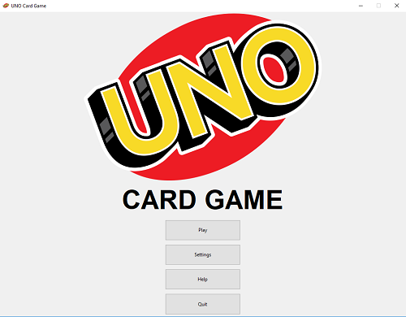
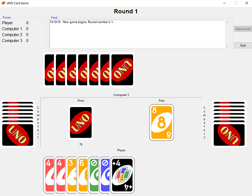

# UNO Card Game

This is my UNO Card Game repository. A single player game, that can be played with 1-3 computer players. 

## Getting Started

1. Download the repo
2. Run main.py in the root folder
3. Profit

### Prerequisites

The app has been built with Python 3.6.5. I use f-strings so the code won't run if you have a pre-f-string version of Python. 

## Built With

* Python 3.6.5
* tkinter
* No external dependencies

## License

This project is licensed under the MIT License - see the [LICENSE](LICENSE) file for details